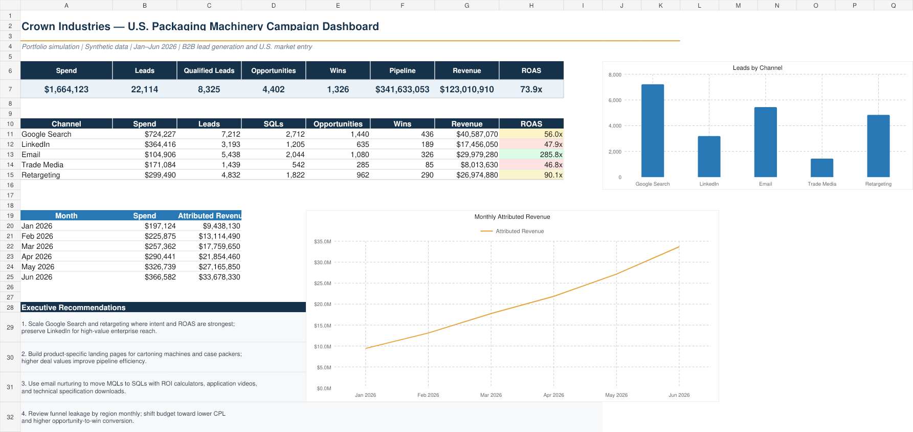
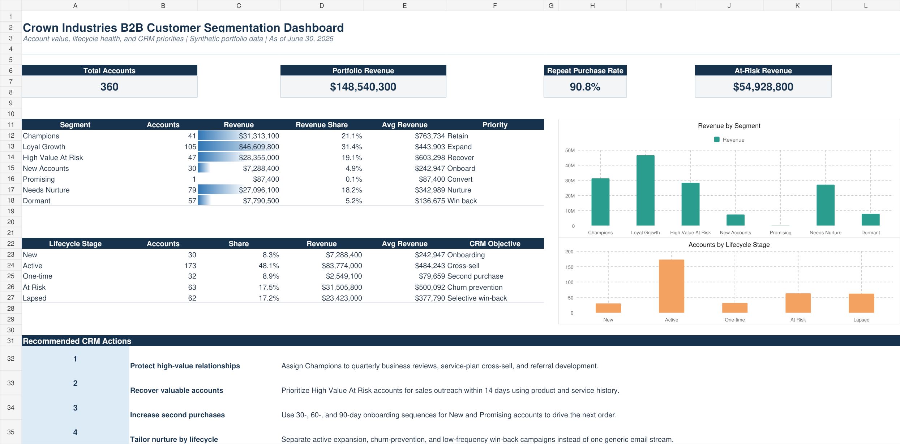

# Karthik Gudi | Digital Marketing & CRM Analytics

Digital marketing and CRM analytics professional focused on campaign performance, customer journeys, audience segmentation, lifecycle behavior, and measurable growth.

This portfolio demonstrates how I turn marketing data into clear insights, dashboards, and optimization recommendations using SQL, Excel, Power BI, GA4, CRM platforms, and visualization tools.

## Featured case studies

### [Crown Industries — U.S. Packaging Machinery Marketing Analytics](crown-industries-case-study/)

A simulated B2B market-entry and lead-generation analysis for a packaging-machinery manufacturer. The project connects campaign spend and engagement with lead qualification, opportunities, wins, pipeline, and attributed revenue.

**Project highlights**

- Built a synthetic dataset with 480 campaign records covering January–June 2026
- Compared Google Search, LinkedIn, email, trade media, and retargeting performance
- Analyzed the funnel from impressions and clicks through MQLs, SQLs, opportunities, and wins
- Evaluated CTR, conversion rate, CPL, ROAS, pipeline, revenue, and win rate
- Produced a formula-driven Excel dashboard with channel, product, and regional views
- Developed practical budget, content, and conversion-optimization recommendations

**Explore the work**

- [Read the complete case study](crown-industries-case-study/)
- [Open the Excel dashboard](crown-industries-case-study/crown-industries-marketing-analytics-case-study.xlsx)
- [View the synthetic campaign dataset](crown-industries-case-study/crown-industries-campaign-data.csv)

> **Data note:** This is a portfolio simulation built with synthetic data. It contains no actual customer, campaign, financial, or confidential Crown Industries information.

### [Crown Industries — B2B Customer Segmentation and Lifecycle Analytics](crown-industries-customer-segmentation/)

An account-level CRM analytics project that uses recency, frequency, monetary value, and lifecycle stage to identify high-value relationships, at-risk accounts, onboarding needs, and repeat-purchase opportunities.

**Project highlights**

- Analyzed 360 synthetic B2B accounts and 1,282 orders
- Created seven actionable customer segments and five lifecycle stages
- Assigned account-level CRM actions for retention, recovery, onboarding, nurture, and win-back campaigns
- Built a formula-driven Excel dashboard with segment revenue, lifecycle health, and executive recommendations

**Explore the work**

- [Read the complete segmentation case study](crown-industries-customer-segmentation/)
- [Open the customer segmentation workbook](crown-industries-customer-segmentation/crown-industries-b2b-customer-segmentation.xlsx)

> **Data note:** This project also uses synthetic portfolio data and contains no actual customer, order, financial, or confidential Crown Industries information.

## Core capabilities

| Area | Capabilities |
|---|---|
| Campaign analytics | KPI reporting, attribution, funnel analysis, A/B testing, ROI measurement |
| Customer analytics | Segmentation, lifecycle analysis, cohort analysis, journey measurement |
| Reporting | Executive dashboards, data visualization, automated reporting, performance recommendations |
| Marketing technology | CRM reporting, web analytics, tag management, marketing automation |

## Tools

- **Analytics and reporting:** SQL, Excel, Power BI, Tableau, Python
- **Digital analytics:** Google Analytics 4, Adobe Analytics, Google Tag Manager
- **CRM and automation:** Salesforce, HubSpot, Marketo
- **Marketing measurement:** Campaign KPIs, attribution, funnel analysis, cohort analysis, and ROI

## Portfolio roadmap

- [x] Campaign performance and funnel analytics
- [x] Executive KPI dashboard
- [x] Customer segmentation and lifecycle analysis
- [ ] Website and GA4 measurement case study
- [ ] A/B testing and conversion-optimization case study

---

I combine digital marketing knowledge with analytics to help teams understand performance, improve customer journeys, and make better growth decisions.
