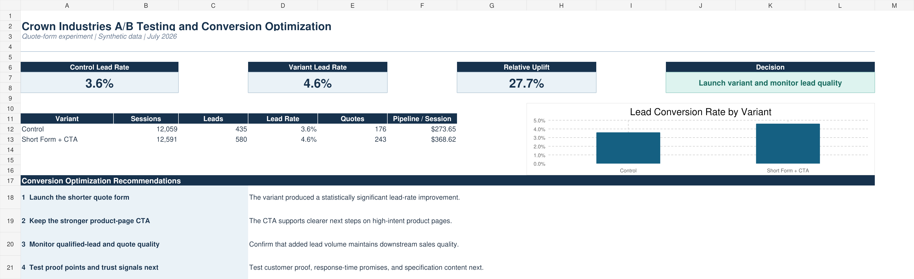

# Crown Industries A/B Testing and Conversion Optimization

This case study evaluates whether a shorter B2B quote form and a stronger product-page call to action can improve lead generation for Crown Industries.

## Business question

Can Crown Industries increase quote-form conversions by reducing form friction without losing downstream lead quality?

## Experiment design

- **Control:** Existing six-field quote form
- **Variant:** Shorter three-field form with a stronger **Request a Quote** CTA
- **Duration:** 28 days
- **Traffic allocation:** 50/50
- **Dataset:** 24,650 synthetic sessions
- **Primary metric:** Lead conversion rate
- **Decision rule:** At least 10,000 sessions per variant and an absolute z-score of 1.96 or higher

## Results

| Metric | Control | Short Form + CTA |
|---|---:|---:|
| Sessions | 12,059 | 12,591 |
| Leads | 435 | 580 |
| Lead conversion rate | 3.6% | 4.6% |
| Quotes | 176 | 243 |
| Pipeline per session | $273.65 | $368.62 |

The variant produced a **27.7% relative lift in lead conversion rate** and met the statistical threshold. The recommended decision is to launch the shorter form and stronger CTA while monitoring qualified-lead rate, quote quality, and downstream sales outcomes.

## Workbook contents

- **Dashboard:** Executive summary, KPI comparison, chart, decision, and recommendations
- **Experiment Analysis:** Conversion calculations, statistical test, and segment findings
- **Daily Data:** Daily control and variant performance
- **Experiment Plan:** Hypothesis, success metrics, guardrails, and decision criteria
- **Methodology:** Definitions, assumptions, formulas, and limitations

## Skills demonstrated

- A/B test design and hypothesis development
- Two-proportion significance testing
- Conversion-funnel analysis
- KPI and dashboard development
- Business-impact interpretation
- Experiment rollout recommendations

## Files

- [`crown-industries-ab-testing-conversion-optimization.xlsx`](crown-industries-ab-testing-conversion-optimization.xlsx)
- [`crown-industries-ab-testing-dashboard.png`](crown-industries-ab-testing-dashboard.png)

## Data note

This is a portfolio case study built with synthetic data. The results demonstrate the analysis workflow and do not represent an actual live experiment.
